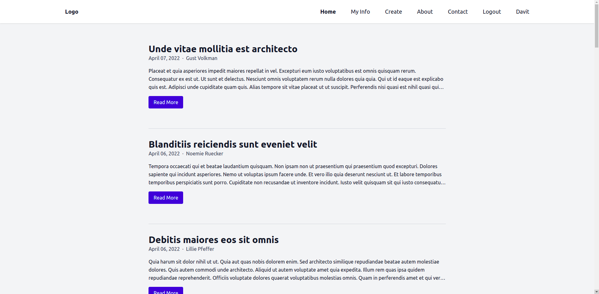

## App looks like

## Setup

Make sure to install the dependencies

```bash
yarn install
or
npm install
```

## Development

Start the development server on http://localhost:3000

```bash
yarn dev
or
npm run dev
```

## Packages
* [tailwindcss](https://tailwindcss.com/) and [@tailwindcss/line-clamp](https://github.com/tailwindlabs/tailwindcss-line-clamp)
* [data-fns](https://date-fns.org/docs/Getting-Started)
* [js-cookie](https://github.com/js-cookie/js-cookie)
  
## Resources

* [Backend](https://github.com/davitlabadze/vuex3-blog-backend.git)